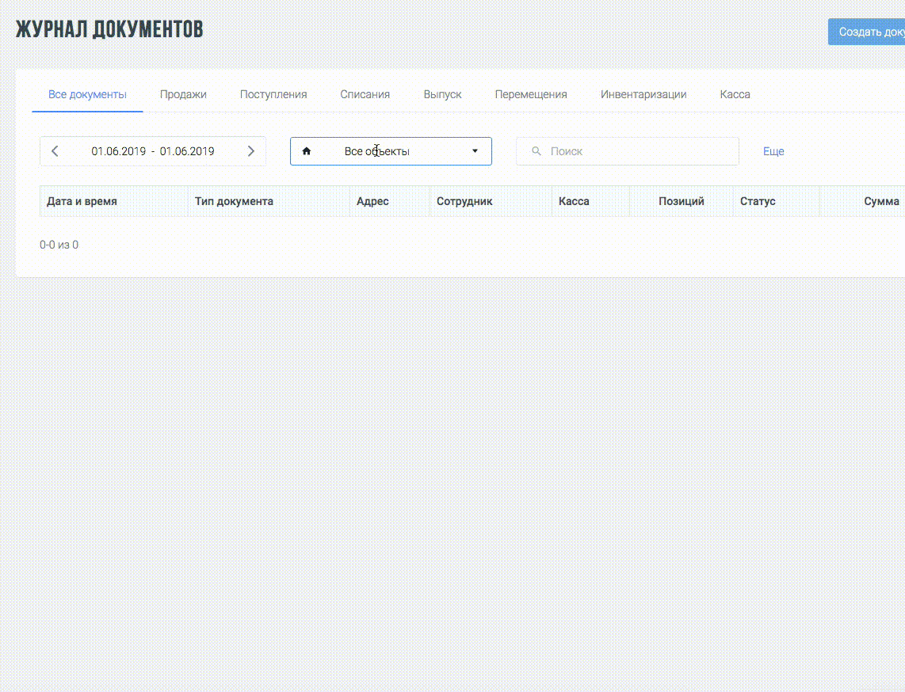

Example of React v16.0 multiselect component:



```jsx
import React from 'react';
import { map } from 'lodash/collection';
import { without } from 'lodash/array';
import './style.scss';

class Select extends React.PureComponent {
  inputSearch = React.createRef();

  constructor(props) {
    super(props);
    this.state = {
      all: false,
      open: false,
      selected: [],
      items: props.options
    };
  }

  openSelect = (e) => {
    e.preventDefault();

    this.setState(
      {
        open: true,
        items: this.props.options
      },
      () => {
        this.inputSearch.current.focus();
        document.addEventListener('mouseup', this.onMouseUp);
      }
    );
  };

  onMouseUp = (e) => {
    if (!e.target.closest('.storev2-wrap')) {
      this.setState(
        {
          open: false
        },
        () => {
          document.removeEventListener('mouseup', this.onMouseUp);
        }
      );
    }
  };

  onSearch = (e) => {
    const value = e.target.value;

    this.setState({
      selected: [],
      items: this.props.options.filter((item) =>
        item.value.match(new RegExp(value, 'giu'))
      )
    });
  };

  checkAll = () => {
    const all = !this.state.all;
    this.setState(
      {
        all,
        selected: all ? map(this.state.items, 'id') : []
      },
      () => {
        this.props.onChange(this.state.selected);
      }
    );
  };

  handleChange = (event) => {
    const { selected } = this.state;
    const value = Number(event.target.value);
    const inArray = selected.indexOf(value) > -1;
    const newList = inArray ? without(selected, value) : selected.concat(value);

    this.setState(
      {
        selected: newList
      },
      () => {
        this.props.onChange(this.state.selected);
      }
    );
  };

  render() {
    let placeholder;

    if (this.state.selected.length > 0) {
      placeholder = (
        <React.Fragment>
          <i className="icon md-home" aria-hidden="true" />

          <span className="text" onClick={this.openSelect}>
            Выбрано ({this.state.selected.length})
          </span>
        </React.Fragment>
      );
    } else {
      placeholder = (
        <React.Fragment>
          <i className="icon md-home" aria-hidden="true" />
          <span className="text" onClick={this.openSelect}>
            Все объекты
          </span>
          <i className="icon wb-triangle-down" aria-hidden="true" />
        </React.Fragment>
      );
    }

    const dropdown = (
      <React.Fragment>
        <i className="icon wb-search" aria-hidden="true" />
        <input
          className="search-input"
          type="text"
          ref={this.inputSearch}
          onChange={this.onSearch}
        />
        <div className="search-list">
          <ul>
            <div className="checkbox-custom checkbox-primary">
              <input
                checked={this.state.all}
                value={this.state.all}
                type="checkbox"
                onChange={this.checkAll}
                name="all"
                id="all"
              />
              <label htmlFor="all">
                <b>Все объекты</b>
              </label>
            </div>
            {this.state.items.map((option, key) => (
              <li key={key}>
                <div className="checkbox-custom checkbox-primary">
                  <input
                    id={option.id}
                    checked={this.state.selected.indexOf(option.id) > -1}
                    value={option.id}
                    type="checkbox"
                    name="checkboxes"
                    onChange={this.handleChange}
                  />
                  <label htmlFor={option.id}>{option.value}</label>
                </div>
              </li>
            ))}
          </ul>
          <span className="checked-count">
            Выбрано ({this.state.selected.length})
          </span>
        </div>
      </React.Fragment>
    );

    const addStyle = {};
    if (this.state.open) {
      addStyle.borderBottom = 0;
      addStyle.borderBottomRightRadius = 0;
      addStyle.borderBottomLeftRadius = 0;
    }

    return (
      <div className="storev2-wrap" style={addStyle}>
        {this.state.open ? dropdown : placeholder}
      </div>
    );
  }
}

export default Select;
```

style.scss:

```scss
.storev2-wrap {
  color: #1d252c;
  height: 2.573rem;
  font-weight: 100;
  border-color: #e4eaec;

  font-size: 1rem;
  line-height: 1.57142857;
  border: 1px solid #e4eaec;
  border-radius: 0.215rem;
  display: flex;
  flex-flow: row wrap;
  align-items: center;
  padding: 0 17px 0 14px;
  position: relative;

  width: 255px;

  .text {
    padding-left: 42px;
    cursor: text;
  }

  .search-input {
    border: 0;
    outline: 0;
    padding-left: 12px;
  }

  .wb-triangle-down {
    margin-left: auto;
  }

  &:hover {
    border-color: #3e8ef7;
  }

  .search-list {
    position: absolute;
    border: 1px solid #e4eaec;

    width: 255px;
    top: 2.5rem;
    left: -1px;
    background: white;

    ul {
      list-style: none;
      padding: 0;
      margin: 0;
      height: 210px;
      overflow: auto;
    }

    .checked-count {
      padding: 10px;
      bottom: 0;
      position: absolute;
      background: #fff;
      width: 100%;
      z-index: 1;
    }

    label {
      width: 100%;
    }
  }
}
```
